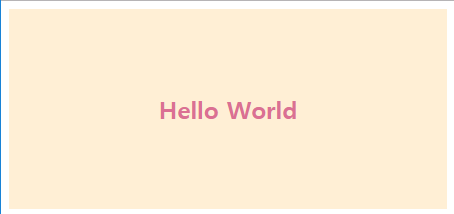

# [Style Playground](https://github.com/play-js/style-playground)

[](https://github.com/styled-components/styled-components)

## [Demo](https://play-js.github.io/style-playground/)

<!-- <!--  -->



## Install
```
npm install
```

## Start
```
npm start
```

## Prerequisites
- Node.js >= 6.x (Recommended the latest version)

## 🌏 Supported Browser
|  IE |  Edge |  Firefox |  Chrome |  Safari |
|----|-------|---------|--------|--------|
| >= 11 | >= 14 | >= 45 | >= 49 | >= 10 |


## [License]((https://github.com/qvil/react-playground/blob/master/LICENSE))
[MIT](https://github.com/play-js/style-playground/blob/master/LICENSE)
